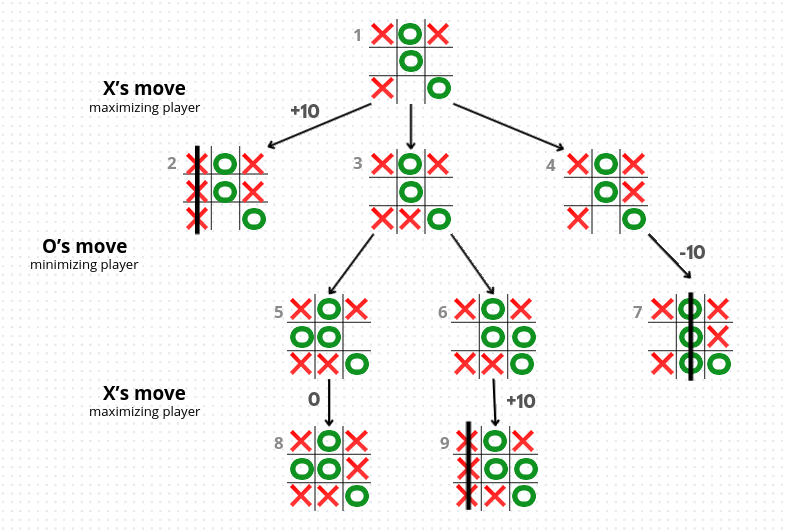
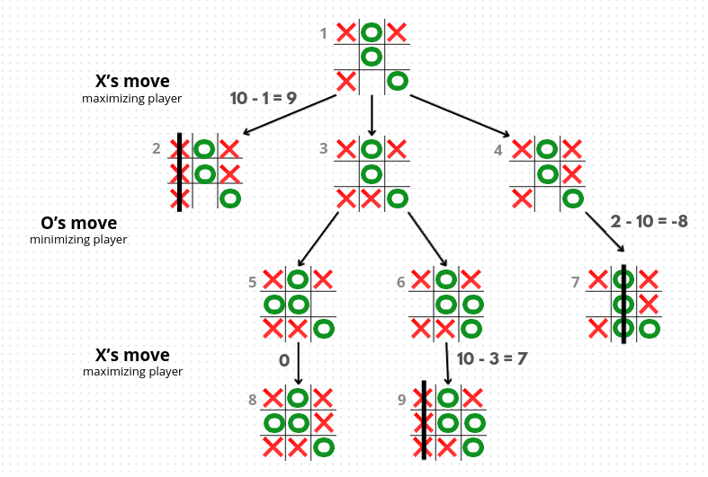

# Algorytm *Minimax* w zastosowaniu do gry w kółko i krzyżyk ⭕❌


## 1. Wprowadzenie
Niniejszy projekt to implementacja gry w **kółko i krzyżyk** w języku **Python** z graficznym interfejsem użytkownika stworzonym przy użyciu biblioteki **Tkinter**. Gra pozwala na rozgrywkę zarówno między dwoma graczami, jak i przeciwko komputerowi. Komputer oferuje trzy poziomy trudności: EASY (ruchy losowe), MEDIUM (częściowo optymalne ruchy na podstawie algorytmu *Minimax*) oraz HARD (pełne wykorzystanie algorytmu *Minimax* do wyboru najbardziej optymalnych posunięć).

Projekt łączy prostotę klasycznej gry planszowej z inteligentnym systemem decyzji AI oraz czytelnym i atrakcyjnym wizualnie interfejsem, zapewniającym wygodną i przyjemną rozgrywkę.

Poniżej znajdują się szczegółowe informacje dotyczące projektu, obejmujące zasady gry w kółko i krzyżyk, opis dostępnych funkcjonalności, wyjaśnienie idei i działania algorytmu *Minimax*, a także omówienie struktury projektu i metod zastosowanych w poszczególnych klasach.

## Spis treści
- [2. Zasady gry](#2-zasady-gry)
  - [2.1 Ustawienia początkowe](#21-ustawienia-początkowe)
  - [2.2 Przebieg rozgrywki](#22-przebieg-rozgrywki)
- [3. Wybrane funkcjonalności](#3-wybrane-funkcjonalności)
  - [3.1 Tryby gry](#31-tryby-gry)
  - [3.2 Możliwość wyboru ustawień gry](#32-możliwość-wyboru-ustawień-gry)
  - [3.3 Analiza gry](#33-analiza-gry)
- [4. Algorytm Minimax](#4-algorytm-minimax)
  - [4.1 Działanie](#41-działanie)
    - [4.1.1 Warunek końcowy](#411-warunek-końcowy)
    - [4.1.2 Maximizing_player](#412-maximizing_player)
    - [4.1.3 Minimizing_player](#413-minimizing_player)
  - [4.2 Wizualizacja działania algorytmu](#42-wizualizacja-działania-algorytmu)
    - [4.2.1 Drzewo gry](#421-drzewo-gry)
    - [4.2.2 Inne](#422-inne)
- [5. Uruchamianie](#5-uruchamianie)
- [6. Struktura projektu](#6-struktura-projektu)
- [7. Metody poszczególnych klas](#7-metody-poszczególnych-klas)
    - [7.1 TicTacToeApp](#71-tictactoeapp)
    - [7.2 StartFrames](#72-startframes)
    - [7.3 SettingsFrames](#73-settingsframes)
    - [7.4 GameLogic](#74-gamelogic)
    - [7.5 GameplayFrames](#75-gameplayframes)


## 2. Zasady gry
Gra w **kółko i krzyżyk** (*Tic Tac Toe*) to prosta gra strategiczna dla dwóch graczy, rozgrywana na planszy `3x3`. **Celem jest ułożenie trzech swoich symboli w jednej linii** – poziomej, pionowej lub diagonalnej – **zanim zrobi to przeciwnik.**

### 2.1 Ustawienia początkowe
- Plansza składa się z 3 rzędów i 3 kolumn.
- Jeden gracz używa symbolu `✕`, drugi `○`.
- Wszystkie pola są początkowo puste.

### 2.2 Przebieg rozgrywki
- Gracze wykonują naprzemienne ruchy, wstawiając swoje symbole w wolne pola.
- Gracz, który pierwszy ułoży linię z trzech symboli, **wygrywa**.
- Jeśli plansza zostanie całkowicie zapełniona i nikt nie wygra, gra kończy się **remisem**.

## 3. Wybrane funkcjonalności
Gra oferuje następujące funkcjonalności:

### 3.1 Tryby gry:
- **Gra z komputerem** - pozwala zmierzyć się z AI. Gracz może wybrać jeden z trzech poziomów trudności:
    - `EASY` - komputer wykonuje ruchy losowo, bez strategii.
    - `MEDIUM` - komputer korzysta z algorytmu Minimax z ograniczoną głębokością, podejmując częściowo optymalne decyzje.
    - `HARD` - komputer stosuje pełny algorytm Minimax, analizując wszystkie możliwe scenariusze i wybierając najbardziej optymalne ruchy.
- **Gra z przyjacielem** - tryb dla dwóch graczy na tym samym komputerze.

### 3.2 Możliwość wyboru ustawień gry
- Gracz może wybrać swój symbol (`✕` lub `○`)
- Wybór gracza rozpoczynającego grę (`player1`, `player2` lub `losowo`)
- Możliwość nadania własnych nicków w trybie dla dwóch graczy

### 3.3 Analiza gry
- Możliwość przeglądania całej historii rozgrywki po jej zakończeniu - nawigacja po wykonanych ruchach – ruch w przód i w tył
- Podświetlanie optymalnych ruchów wyznaczonych przez algorytm *Minimax* (dotyczy rozgrywek z komputerem)


##  4. Algorytm *Minimax*
*Minimax* to algorytm decyzyjny stosowany w grach dwuosobowych, takich jak kółko-krzyżyk, szachy czy warcaby. Jego celem jest wybranie najlepszego możliwego ruchu dla jednego gracza, przy założeniu, że przeciwnik również gra optymalnie.

W algorytmie wyróżnia się dwóch graczy: 
- `maximizing_player`, który stara się maksymalizować swoją szansę wygranej lub zdobywany wynik 
- `minimizing_player`, który stara się minimalizować szansę wygranej przeciwnika.

Algorytm analizuje wszystkie możliwe ruchy, aby przewidzieć optymalne decyzje dla obu stron i znaleźć strategię prowadzącą do najlepszego możliwego wyniku dla `maximizing_player`.

### 4.1 Działanie
Działanie algorytmu można zapisać w postaci pseudokodu [(źródło)](https://www.geeksforgeeks.org/dsa/finding-optimal-move-in-tic-tac-toe-using-minimax-algorithm-in-game-theory/):

```python
def minmax(state, depth, maximizing_player):
    if is_terminal(state) or depth == 0:
        return utility(state)
    
    if maximizing_player:
        max_eval = -infinity
        for action in actions(state):
            eval = minmax(result(state, action), depth - 1, False)
            max_eval = max(max_eval, eval)
        return max_eval
    else:
        min_eval = infinity
        for action in actions(state):
            eval = minmax(result(state, action), depth - 1, True)
            min_eval = min(min_eval, eval)
        return min_eval
```
#### 4.1.1 Warunek końcowy:
```python
   if is_terminal(state) or depth == 0:
        return utility(state)
```
Jeśli aktualny stan planszy jest końcowy (**wygrana**, **przegrana**, **remis**) lub osiągnięto maksymalną głębokość analizy (`depth == 0`), algorytm zwraca ocenę tego stanu (`utility(state)`), czyli liczbę reprezentującą, czy jest to korzystny ruch dla `maximizing_player`.

Jako ocenę stanu (`utility(state)`) zazwyczaj przyjmuje się proste wartości liczbowe: np. 
- `+10` dla wygranej gracza maksymalizującego (`maximizing_player`), 
- `-10` dla wygranej przeciwnika (`minimizing_player`), 
- `0` w przypadku remisu.

**Uwaga:** W ninejszej implementacji zamiast prostych wag wzięto tez pod uwagę głebokość, czyli liczbę ruchów potrzebnych do osiągnięcia danego stanu. Dzięki temu algorytm preferuje **szybsze zwycięstwa** i **opóźnia przegrane**, co pozwala podejmować bardziej strategiczne decyzje. Przyjęte oceny:
- `10 - curr_depth` - wygrana `maximizing_player`,
- `curr_depth - 10` - przegrana `maximizing player`,
- `0` - remis.

#### 4.1.2 Maximizing_player:
```python
   if maximizing_player:
        max_eval = -infinity
        for action in actions(state):
            eval = minmax(result(state, action), depth - 1, False)
            max_eval = max(max_eval, eval)
        return max_eval
```
W tym fragmencie algorytmu *Minimax* rozpatrujemy sytuację, gdy gracz maksymalizujący (`maximizing_player`) wykonuje swój ruch. Celem gracza maksymalizującego jest wybranie takiego ruchu, który maksymalizuje jego szansę wygranej, czyli uzyskanie najwyższej możliwej wartości zwracanej przez funkcję `utility(state)`.

- Rozpoczynamy od inicjalizacji zmiennej przechowującej najlepszą ocenę znalezioną do tej pory. Zaczynamy od bardzo niskiej wartości, aby każdy faktyczny wynik był większy (`max_eval = -infinity`).
- `for action in actions(state):` - przeglądamy wszystkie możliwe ruchy w bieżącym stanie gry.
- `eval = minmax(result(state, action), depth - 1, False)` - dla każdego ruchu algorytm jest wywoływany rekurencyjnie w celu oceny jego konsekwencji. Zakłada się przy tym, że kolejny ruch wykona gracz minimalizujący (`minimizing_player`), który dąży do zmniejszenia szans wygranej gracza maksymalizującego, wybierając dla niego **jak najmniej korzystne** opcje.
- `max_eval = max(max_eval, eval)` - aktualizujemy najlepszą ocenę dla `maximizing_player`, wybierając najwyższą wartość spośród dotychczasowych wyników.
- Po przeanalizowaniu wszystkich możliwych ruchów funkcja zwraca najwyższą ocenę (`max_eval`), odpowiadającą optymalnej decyzji gracza maksymalizującego.


#### 4.1.3 Minimizing_player:
```python
    else:
        min_eval = infinity
        for action in actions(state):
            eval = minmax(result(state, action), depth - 1, True)
            min_eval = min(min_eval, eval)
        return min_eval
```
Tutaj z kolei rozpatrywana jest sytuacja, w której ruch wykonuje gracz minimalizujący (`minimizing_player`). Jego celem jest wybranie takiego posunięcia, które minimalizuje wartość funkcji oceny (`utility(state)`), a tym samym **zmniejsza szansę wygranej gracza maksymalizującego**.

- Na początku zmienna przechowująca najlepszą (czyli w tym przypadku najniższą) ocenę jest inicjalizowana bardzo dużą wartością (`infinity`), aby każdy rzeczywisty wynik mógł ją zastąpić.
- `for action in actions(state):` - przeglądamy wszystkie możliwe ruchy w bieżącym stanie gry.
-  algorytm rekurencyjnie ocenia konsekwencje danego ruchu (`eval = minmax(result(state, action), depth - 1, True)`), przechodząc do kolejnego stanu gry i zakładając, że następny ruch wykona gracz maksymalizujący, czyli gracz dążący do zwiększenia swoich szans na wygraną poprzez wybór najbardziej optymalnego ruchu.
- `min_eval = min(min_eval, eval)` – spośród wszystkich ocen wybierana jest najmniejsza wartość, zgodnie z celem gracza minimalizującego.
- Po przeanalizowaniu wszystkich możliwych ruchów funkcja zwraca najniższą ocenę (`min_eval`), odpowiadającą najbardziej niekorzystnemu scenariuszowi dla `maximizing_player`.


### 4.2 Wizualizacja działania algorytmu
#### 4.2.1 Drzewo gry
Aby lepiej zrozumieć ideę i mechanizm algorytmu  *Minimax*  przeanalizujmy przykładowe drzewo decyzyjne dla gry w **kółko i krzyżyk**, przedstawione na poniższym rysunku:


Każdy węzeł drzewa reprezentuje konkretny stan planszy, natomiast liczby umieszczone po lewej stronie oznaczają kolejne numery węzłów (stanów planszy) analizowanych przez algorytm.


Węzeł nr `1` (korzeń drzewa) przedstawia aktualny stan planszy po wykonaniu ruchu przez gracza `O`. W tym momencie decyzję podejmuje gracz `X`, który pełni rolę gracza maksymalizującego (`maximizing player`). Jego celem jest wybór takiego ruchu, który zmaksymalizuje jego szansę na wygraną.

Z węzła `1` wychodzą trzy gałęzie prowadzące do węzłów `2`, `3` i `4`, które reprezentują trzy możliwe ruchy gracza `X`. Wynika to z faktu, że na planszy pozostały dokładnie trzy wolne pola, w których `X` może postawić swój znak. Poniżej przeanalizowano konsekwencje wyboru każdej z tych możliwości:

-  **węzeł nr `2`** -  ruch ten prowadzi do natychmiastowego zwycięstwa gracza `X`. Powoduje on ułożenie trzech znaków w linii, dlatego stan ten otrzymuje najwyższą ocenę (`+10`). Jest to **najkorzystniejszy ruch z punktu widzenia gracza maksymalizującego**.
- **węzeł nr `3`** - gra nie kończy się bezpośrednio i przechodzi do kolejnej tury, w której ruch wykonuje gracz `O`, pełniący rolę gracza minimalizującego (`minimizing player`). W tej sytuacji możliwe są dwa warianty:
    - **węzeł nr `5`** - prowadzi to do remisu.
    - **węzeł nr `6`** - w dalszej perspektywie prowadzi do zwycięstwa gracza maksymalizującego (węzeł nr `10`). Jest to więc **korzystny scenariusz**.
- **węzeł nr `4`** - podobnie jak w przypadku węzła `3`, gra nie kończy się natychmiast. W tym wariancie jednak gracz minimalizujący może wykonać ruch odpowiadający węzłowi nr `7`, który prowadzi do jego zwycięstwa. Z punktu widzenia gracza maksymalizującego jest to **najgorszy możliwy scenariusz**, ponieważ kończy się przegraną.


W przykładzie przedstawionym powyżej widać dwa scenariusze prowadzące do zwycięstwa gracza maksymalizującego: jeden osiągany w jednym ruchu (węzeł `2`), a drugi w trzech ruchach (węzeł `10`). W klasycznym algorytmie *Minimax* oba traktowane są jako **równie dobre**. Z reguły jednak przyjmuje się, że **szybsza wygrana jest korzystniejsza** i  analogicznie, **wolniejsza przegrana jest lepsza niż szybka przegrana**.

Dlatego w niniejszej implementacji, zgodnie z tym co zapisano w podrozdziale `4.1.1`, do oceny węzłów dodano również głębokość, czyli liczbę ruchów potrzebnych do osiągnięcia danego stanu. Przy zastosowaniu takiego podejścia analizowane wcześniej drzewo gry i przypisane wagi prezentują się następująco:


Jak widać, drzewo faworyzuje szybkie zwycięstwa: wygrana w jednym ruchu otrzymuje wartość `+9`, natomiast w trzech ruchach `+7`, co pokazuje **preferencję szybszych wygranych**.

#### 4.2.2 Inne
Link do wideo prezentującego ogólną ideę działania algorytmu *Minimax* w grze w kółko i krzyżyk:

[ Simple Explanation of the Minimax Algorithm with Tic-Tac-Toe - *Science Buddies*](https://www.youtube.com/watch?v=5y2a0Zhgq0U)


## 5. Uruchamianie
Gra **Tic Tac Toe** została napisana w **Pythonie** i wykorzystuje bibliotekę **Tkinter** do wyświetlania interfejsu graficznego.  

Aby uruchomić grę, wykonaj następujące kroki:

1. **Upewnij się, że Python 3.x i Tkinter są zainstalowane** - gra wymaga Pythona w wersji `3.x`. Tkinter jest dostarczany razem z Pythonem, więc zwykle nie trzeba go instalować osobno. W niektórych przypadkach (np. w systemie *Windows*) Tkinter może nie zostać zainstalowany lub zostać usunięty. Wtedy:
    - Instalacja przez PIP (użytkownik lub środowisko wirtualne):
      ```bash
      pip install tk
      ```

    - Instalacja przez APT (dla całego komputera) - Zainstaluj pakiety `python-tk`, `python3-tk` oraz wymagane zależności.


2. **Pobierz projekt** – sklonuj repozytorium lub pobierz pliki gry do wybranego katalogu.
3. **Otwórz terminal lub konsolę** i przejdź do katalogu z plikami projektu. 
4. **Uruchom aplikację poleceniem:** 
   ```bash
   python tic_tac_toe_app.py
   ```

## 6. Struktura projektu

Projekt jest zorganizowany w sposób modułowy, a aplikacja składa się z **pięciu klas**, które odpowiadają za różne aspekty GUI oraz całej gry.

- **TicTacToeApp** (`tic_tac_toe_app.py`)  - główna klasa aplikacji, która koordynuje współpracę pomiędzy logiką gry (`GameLogic`) a warstwą graficzną (klasy odpowiedzialne za poszczególne ekrany), pełniąc rolę centralnego kontrolera aplikacji.

- **GameLogic** (`game_logic.py`)  - klasa odpowiedzialna za całą logikę gry w kółko i krzyżyk. Zarządza stanem planszy, sprawdza warunki zwycięstwa i remisu oraz obsługuje przebieg gry w różnych trybach trudności. **Zawiera implementację algorytmu *Minimax***, wykorzystywanego do podejmowania optymalnych decyzji przez komputer, a także prostsze strategie oparte na losowości dla niższych poziomów trudności.

- **StartFrames** (`start_frames.py`)  - klasa odpowiedzialna za ekran startowy aplikacji oraz wyświetlanie zasad gry. Umożliwia wybór trybu rozgrywki (gra z komputerem lub z innym graczem) oraz zapewnia dostęp do opisu zasad gry poprzez dedykowany ekran informacyjny.

- **SettingsFrames** (`settings_frames.py`)  - klasa odpowiedzialna za konfigurację rozgrywki przed jej rozpoczęciem. Obsługuje wybór poziomu trudności gry z komputerem, ustawienia symboli graczy, wybór rozpoczynającego gracza oraz (w trybie gry z innym graczem) wprowadzanie nicków. Zapewnia walidację ustawień i przekazuje je do logiki gry przed startem rozgrywki.

- **GameplayFrames** (`gameplay_frames.py`)  - klasa odpowiedzialna za właściwą rozgrywkę oraz wszystkie ekrany z nią związane. Obsługuje wyświetlanie planszy gry, interakcję użytkownika z planszą, przebieg tury graczy oraz komunikację z logiką gry. Zawiera również ekran zakończenia gry oraz tryb analizy rozgrywki, umożliwiający przeglądanie wykonanych ruchów i porównanie ich z optymalnymi decyzjami wyznaczonymi przez algorytm *Minimax* (obecnie analiza możliwa tylko dla rozgrywek w trybie gry z komputerem).

## 7. Metody poszczególnych klas
### 7.1 TicTacToeApp
- `def show_frame(self, new_frame)` - Wyświetla wskazany ekran (*frame*) aplikacji, jednocześnie ukrywając poprzedni. Zachowuje historię poprzednich ekranów, aby umożliwić powrót do nich.

- `def go_to_previous_frame(self)` - Przywraca poprzedni ekran z historii, ukrywając aktualnie wyświetlany. 

- `def create_topbar(self, parent, bgc, show_back = False, show_rules =False, back_command = None)` - Tworzy pasek górny (*topbar*) dla podanego ekranu, zawierający opcjonalnie przycisk „wstecz” (`show_back = True`) lub przycisk „?" ( `show_rules = True`) do wyświetlania zasad gry. Funkcja odpowiada za wygląd i zachowanie przycisków, w tym ustawienie kolorów, czcionki i akcji po kliknięciu. Argument `back_command` – opcjonalna funkcja wywoływana po kliknięciu przycisku *wstecz*; jeśli nie zostanie podana, używany jest domyślny powrót do poprzedniego ekranu


### 7.2 StartFrames
- `def create_start_frame(self)` - tworzy ekran startowy gry z tytułem i dwoma przyciskami umożliwiającymi wybór trybu rozgrywki: **gra z komputerem** lub **gra z przyjacielem**. Tworzony ekran zawiera też przycisk umożliwiający wyświetlenie ekranu z zasadami gry.

- `def set_game_mode(self, mode)` - ustawia wybrany tryb gry i przygotowuje odpowiedni ekran ustawień rozgrywki.

- `def create_rules_frame(self)` - tworzy ekran z krótką instrukcją gry w kółko i krzyżyk; opisuje zasady przebiegu rozgrywki, warunki zwycięstwa i remisu oraz informuje o możliwości gry z komputerem lub z innym graczem.


### 7.3 SettingsFrames
- `def create_difficulty_level_frame(self)` - tworzy ekran wyboru poziomu trudności gry z komputerem; wyświetla przyciski dla poziomów `EASY`, `MEDIUM` i `HARD`.

- `def select_difficulty(self, lvl)` - funkcja zapisuje wybany poziom trudności i otwiera ekran ustawień gry.

- `def clean_choices(self)` - czyści wcześniejsze wybory graczy w ustawieniach gry, resetując symbole obu graczy oraz ustawienie rozpoczynającego gracza.

- `def create_game_settings_frame(self)` - tworzy ekran ustawień gry, w którym gracz wybiera swój symbol oraz rozpoczynającego gracza. W trybie gry z przyjacielem umożliwia również wprowadzenie nicków. Funkcja przygotowuje przycisk startu, który uruchamia rozgrywkę po dokonaniu wyborów.

- `def create_nicknames_subframe(self)` - tworzy część ekranu ustawień, w której gracze w trybie dwuosobowym mogą wpisać swoje nicki. Funkcja ustawia domyślne nazwy (`Player1`, `Player2`) i dodaje pola do ich edycji.

- `def validate_nicknames(self)` - sprawdza poprawność wprowadzonych nicków w trybie dla dwóch graczy. Ogranicza długość do `10` znaków, a w przypadku pustych pól ustawia domyślne nazwy `Player1` i `Player2`.

- `def show_who_starts_sf(self)` - ustawia symbol drugiego gracza na przeciwny do wybranego przez gracza pierwszego i wyświetla subframe umożliwiający wybór, kto rozpoczyna grę.

- `def get_opposite_symbol(self, symbol)` - zwraca przeciwny symbol do podanego - używane do automatycznego przypisania symbolu drugiemu graczowi.

- `def show_start_game_btn(self)` - wyświetla przycisk `START GAME` po wybraniu symbolu i ustawienia rozpoczynającego gracza.


### 7.4 GameLogic
- `def initialize_game(self, p1_symbol, p2_symbol)` - funkcja pomocnicza, która resetuje stan gry przed rozpoczęciem nowej rozgrywki; ustawia symbole graczy, czyści planszę, zeruje historię ruchów i oznacza grę jako aktywną.

- `def is_board_full(self, board)` - sprawdza, czy plansza jest całkowicie zapełniona i nie ma już pustych pól. Zwraca `True`, jeśli wszystkie komórki są zajęte, w przeciwnym razie `False`.

- `def is_board_empty(self, board)` - prawdza, czy plansza jest całkowicie pusta; zwraca `True`, jeśli żadne pole nie jest zajęte.

- `def get_empty_cells(self, board)` - zwraca listę współrzędnych wszystkich pustych pól na planszy.

- `def get_computer_symbol(self)` - pomocnicza funkcja, która zwraca symbol przypisany komputerowi.

- `def get_human_symbol(self)` - zwraca symbol przypisany graczowi w rozgrywce z komputerem.

- `def make_move(self, row, col)` - wykonuje ruch gracza na podanej pozycji (`row`, `col`); zwraca `False`, jeśli pole jest zajęte lub gra się zakończyła, w przeciwnym razie zapisuje symbol gracza na polu i zwraca `True`.

- `def check_winner(self, board, symbol, return_line = False)` - sprawdza, czy umieszczenie danego symbolu na planszy powoduje wygraną; może zwrócić `True`/`False` lub `listę pól tworzących zwycięską linię`.

- `def is_computer_turn(self)` - sprawdza, czy obecnie jest kolej komputera w rozgrywce w trybie `użytkownik - komputer`.

- `def computer_move_easy(self)` - wybiera losowy pusty ruch dla komputera - strategia stosowana na najłatwiejszym poziomie trudności.

- `def computer_move_medium(self)` -wybiera ruch komputera przy średnim poziomie trudności, korzystając z algorytmu *Minimax* z ograniczoną głębokością (częściowo optymalny ruch).

- `def computer_move_hard(self)` -wybiera optymalny ruch komputera przy najwyższym poziomie trudności, wykorzystując pełny algorytm *Minimax* do analizy wszystkich możliwych scenariuszy.

- `def minmax(self, board, curr_depth, max_depth, maximizing)` - implementacja algorytmu *Minimax*. Argument `max_depth` określa, jak wiele ruchów do przodu algorytm ma analizować (w trybie MEDIUM ogranicza przewidywanie domyślnie do 2 kolejnych ruchów).
Funkcja zwraca liczbę reprezentującą ocenę danego stanu planszy: dodatnią dla korzystnych dla `maximizing_player`, ujemną dla korzystnych dla `minimizing_player` oraz 0 dla remisu.

- `def choose_best_move(self, max_depth = None, randomness = 0)` - funkcja wybiera najlepszy ruch dla komputera na podstawie aktualnego stanu planszy, wykorzystując algorytm *Minimax* do oceny wszystkich możliwych ruchów. Jeśli plansza jest pusta, zwraca losowy ruch; w pozostałych przypadkach tworzy listę ruchów o najwyższej ocenie i zwraca losowy ruch spośród nich. Parametr `randomness` wykorzystywany jest jedynie w trybie MEDIUM i  pozwala czasem na wybranie całkowicie losowego ruchu zamiast najlepszego, co wprowadza element nieprzewidywalności.

- `def get_best_human_move(self, board)` - oblicza i zwraca najlepszy możliwy ruch/ruchy dla gracza człowieka w danym stanie planszy. Funkcja jest wykorzystywana w trybie analizy, aby pokazać, który ruch byłby optymalny według algorytmu *Minimax*.


### 7.5 GameplayFrames
- `def create_game_frame(self)` - tworzy główny ekran rozgrywki, dodaje pasek górny (topbar), panel graczy oraz planszę do gry.

- `def create_players_panel(self, parent, show_turn_label=True)` - tworzy panel wyświetlający informacje o graczach: ich symbole i nazwy, a opcjonalnie pokazuje etykietę wskazującą, czyj jest ruch.

- `def create_board(self, parent, clickable = True)` - tworzy planszę `3x3` z zaokrąglonymi polami i miejscem na symbole graczy; jeśli `clickable = True`, pola reagują na kliknięcia wywołując ruch gracza.

- `def rounded_rect(self, canvas, x1, y1, x2, y2, rad, **args)` - rysuje pojedyncze pole planszy jako zaokrąglony prostokąt na canvasie.

- `def start_game(self)` - rozpoczyna nową rozgrywkę: resetuje planszę i historię ruchów, ustawia symbole graczy, wybiera kto zaczyna (jeżeli wybrano opcję `?`), aktualizuje interfejs i w razie potrzeby wykonuje pierwszy ruch komputera.

- `def handle_move(self, row, col)` - umieszcza aktualny symbol gracza lub komputera na planszy w podanym polu (`row`, `col`). Aktualizuje stan gry, historię ruchów, sprawdza warunek zwycięstwa lub remisu, podświetla zwycięską linię (jeśli istnieje), przełącza turę na drugiego gracza i w razie potrzeby wywołuje ruch komputera.

- `def change_tile_colors(self, p1_color, p2_color, panel)` - zmienia kolory tła kafelków graczy na danym panelu (`panel`), aby wizualnie wskazać aktywnego gracza.

- `def update_turn_label(self)` - aktualizuje tekst i położenie etykiety pokazującej, czyja jest tura, oraz wywołuje funkcję `def change_tile_colors`, by odpowiednio zmienić kolory paneli graczy, zapewniając wyróżnienie aktualnego gracza.

- `def computer_move(self)`- wykonuje ruch komputera na podstawie wybranej strategii trudności (`EASY`, `MEDIUM`, `HARD`) i aktualizuje planszę.

- `def switch_turn(self)` - pomocnicza funkcja do przełączania tury między graczami - aktualizuje `current_player` i `current_symbol`.

- `def highlight_winner(self, line)` - podświetla na planszy pola tworzące zwycięską linię, zmieniając ich kolor na zielony.

- `def confirm_exit_game(self)` - wyświetla okno potwierdzenia wyjścia z trwającej  gry; jeśli użytkownik potwierdzi, opuszcza ekran gry i powraca do poprzedniego ekranu.

- `def create_game_over_frame(self)` - tworzy ekran zakończenia gry, wyświetlający wynik rozgrywki oraz przyciski: `PLAY AGAIN` (kontynuacja z tymi samymi ustawieniami), `START NEW GAME` (powrót do ekranu startowego) i jeśli użytkowik grał przeciwko komputerowi - `ANALYZE GAME` (rozpoczęcie trybu analizy ruchów).

- `def update_analyze_button_visibility(self)` - decyduje o widoczności przycisku `ANALYZE GAME` w ekranie końcowym gry; przycisk jest wyświetlany tylko, jeśli gracz grał przeciwko komputerowi.

- `def start_analysis_mode(self)` - inicjalizuje tryb analizy gry po jej zakończeniu; tworzy ekran z planszą, panelami graczy, przyciskami nawigacji po ruchach (`prev` i `next`) oraz etykietą pokazującą najlepszy ruch użytkownika w danym momencie według algorytmu *Minimax*.

- `def show_move(self, index)` - wyświetla na planszy stan gry z historii dla podanego indeksu, aktualizując symbole pól oraz kolor pola ostatniego ruchu. Dla gracza człowieka dodatkowo podświetla najlepszy możliwy ruch i wypisuje jego współrzędne jako `(row, col)`.

- `def update_analysis_player_colors(self, player_id)` - aktualizuje kolory paneli graczy w trybie analizy gry, podświetlając aktywnego gracza.

- `def prev_move(self)` - w trybie analizy gry wraca do poprzedniego ruchu w historii rozgrywki i aktualizuje planszę, aby pokazać wcześniejszą pozycję.

- `def next_move(self)` - w trybie analizy gry przechodzi do następnego ruchu w historii rozgrywki i aktualizuje planszę, aby pokazać kolejną pozycję.


